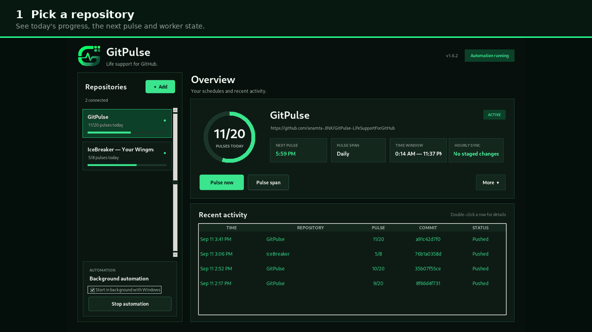
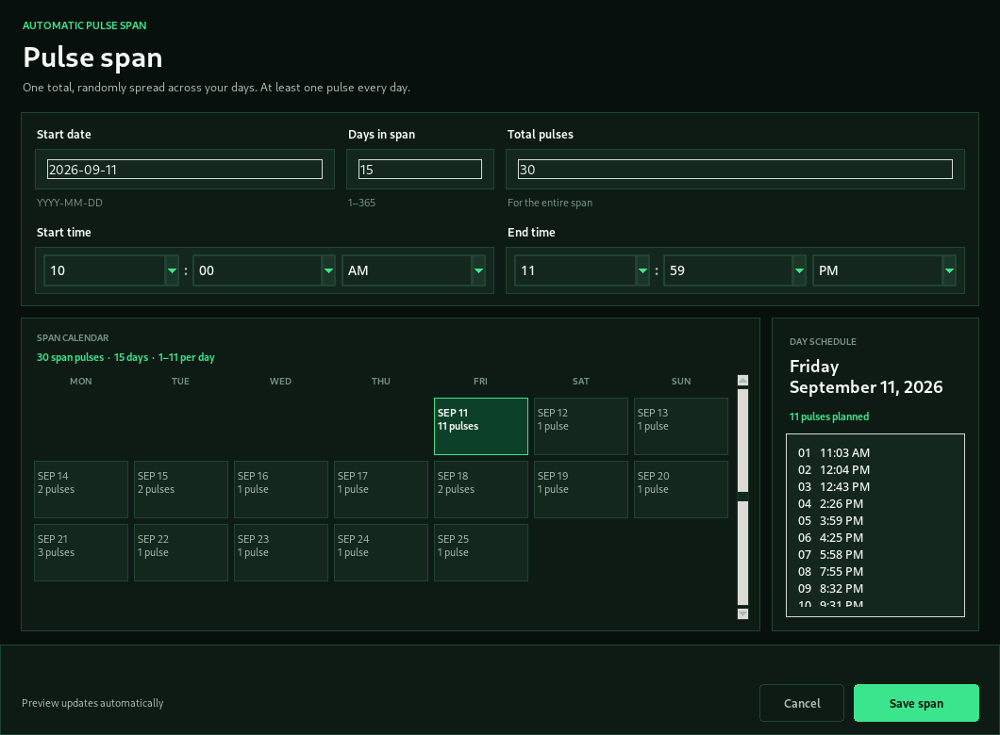
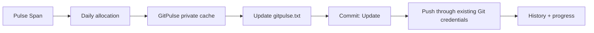
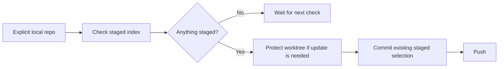

<p align="center">
  
</p>

<p align="center">
  <strong>Life support for GitHub.</strong><br>
  A focused Windows desktop utility for scheduled contribution pulses and safe, opt-in syncing of work you explicitly stage.
</p>

<p align="center">
  
  
  
  
  
  <a href="https://github.com/anamta-JINX/GitPulse-LifeSupportForGitHub/actions/workflows/windows-build.yml"></a>
</p>

<p align="center">
  <a href="#quick-start">Quick start</a> ·
  <a href="#pulse-span">Pulse Span</a> ·
  <a href="#how-it-works">How it works</a> ·
  <a href="#build-the-windows-app">Build</a> ·
  <a href="#project-structure">Structure</a>
</p>

---

## What is GitPulse?

GitPulse is a small Windows desktop app built to keep scheduled GitHub activity predictable without touching work you did not explicitly approve.

It has two separate automation modes:

- **Pulse Span** — choose a start date, number of days, total pulse count and time window. GitPulse randomly distributes the exact total across those days, with at least one pulse per day.
- **Hourly Sync** — opt in to a local repository and GitPulse checks its existing staged index every hour. It never stages your files for you.

Scheduled pulses happen inside GitPulse's private repository cache and modify only `gitpulse.txt`. Local Hourly Sync operates on a folder you explicitly connect and commits only what you already staged with Git.

## Product preview

<p align="center">
  
</p>

The dashboard keeps the circular pulse counter at the center of the experience while exposing only the controls that matter: **Pulse now**, **Pulse span**, repository status, worker state and recent activity.

### See GitPulse in action

<p align="center">
  
</p>

---

## Highlights

| Capability | What it does |
| --- | --- |
| **Circular pulse progress** | Shows completed vs planned pulses at a glance. Manual override pulses can go beyond the planned target and remain visible. |
| **Pulse Span** | Distributes one exact pulse total across 1–365 days with at least one pulse per day. |
| **Randomized times** | Generates unique pulse times inside the selected daily window. |
| **Editable schedules** | Reopen a saved span, change dates, totals or time window, and save the replacement plan. |
| **Real Git commits** | Every scheduled pulse changes `gitpulse.txt`; GitPulse does not rely on empty commits. |
| **Safe scheduled mode** | Scheduled pulses happen in GitPulse-owned private caches and stage only `gitpulse.txt`. |
| **Hourly Sync** | Commits only the files already staged in an explicitly connected local repository. |
| **No surprise staging** | GitPulse does not run `git add` on your local project files. |
| **Recovery-aware Git flow** | Validates remotes, handles behind/diverged branches carefully and protects staged/unstaged work during sync. |
| **Native Windows tray** | Background automation stays available after the dashboard closes. |
| **Multi-repository support** | Manage multiple repositories from one desktop dashboard. |
| **Standalone EXE build** | PyInstaller packaging produces `dist\GitPulse.exe`. |

---

## Pulse Span

Pulse Span is the scheduling model used for automatic pulses.

You define:

- **Start date**
- **Days in span** — 1 to 365
- **Total pulses** for the entire span
- **Start time** and **end time** for each day

GitPulse then creates the daily distribution automatically.

<p align="center">
  
</p>

For example, **30 pulses over 15 days** always produces exactly 30 planned pulses. Every day receives at least one pulse; the remaining pulses are distributed randomly, and each day gets unique times inside the selected window.

Important behavior:

- the saved plan remains stable after restart;
- editing a span replaces the previous allocation instead of stacking another schedule on top;
- there is no hidden second daily schedule competing with Pulse Span;
- completed past dates are preserved when an active span is edited;
- today's target cannot be reduced below pulses already completed today;
- a normal scheduled pulse respects the plan;
- **Pulse now** is an explicit manual override and can create a pulse even when today's planned quota has already been reached.

---

## How it works

<p align="center">
  
</p>

### Scheduled pulse flow



### Hourly Sync flow



GitPulse delegates authentication to **Git / Git Credential Manager**. It does not store your GitHub password or a personal access token.

---

## Quick start

### Requirements

- Windows 10 or Windows 11
- Git for Windows
- permission to push to the repository you connect
- Python 3.10+ only when running from source

### 1. Clone the repository

```powershell
git clone https://github.com/anamta-JINX/GitPulse-LifeSupportForGitHub.git
cd GitPulse-LifeSupportForGitHub
```

### 2. Run from source

No runtime third-party Python package is required.

```powershell
py -3 GitPulse.pyw
```

Or use the Windows helper:

```powershell
scripts\windows\run_source.bat
```

For a silent double-click launch:

```text
scripts\windows\run_source.vbs
```

### 3. Connect a repository

1. Select **+ Add**.
2. Enter the GitHub repository URL and an email associated with your GitHub account.
3. Optionally set a display name and branch.
4. Test the connection.
5. Save the repository.
6. Open **Pulse span** and create the schedule you want.

The first private-repository operation may open Git Credential Manager so you can authenticate.

---

## Build the Windows app

From the project root, run:

```powershell
scripts\windows\build_exe.bat
```

The builder will:

1. create an isolated `.venv-build` environment;
2. install the build dependency from `requirements-dev.txt`;
3. clean previous output;
4. package the app with `packaging\GitPulse.spec`;
5. run the packaged self-test.

The standalone application is created at:

```text
dist\GitPulse.exe
```

### Create a desktop shortcut

After building the EXE, run:

```powershell
scripts\windows\create_shortcut.bat
```

The shortcut uses `assets\gitpulse.ico` directly so the GitPulse icon remains consistent on Windows.

---

## Run the tests

```powershell
py -3 -m unittest discover -s tests -v
```

Current v1.6.2 validation: **54 tests passing**.

The test suite covers Pulse Span allocation, schedule editing, manual pulse override, Git safety, Hourly Sync staging behavior, worker/tray behavior, time handling and Windows packaging regressions.

---

## Project structure

```text
GitPulse/
├── .github/
│   ├── ISSUE_TEMPLATE/
│   │   └── bug_report.yml         # Structured GitHub bug reports
│   ├── CODEOWNERS                 # Repository ownership
│   ├── pull_request_template.md
│   └── workflows/
│       └── windows-build.yml      # CI: tests + Windows EXE artifact
├── assets/
│   ├── gitpulse-banner.png        # README product banner
│   ├── gitpulse-demo.gif          # Real UI demo
│   ├── gitpulse-ui.png            # Dashboard screenshot
│   ├── gitpulse-span.png          # Pulse Span screenshot
│   ├── gitpulse-workflow.png      # Architecture visual
│   ├── gitpulse-logo.png          # Product logo
│   └── gitpulse.ico               # Windows icon
├── gitpulse/
│   ├── __init__.py                # Version + package metadata
│   ├── git_service.py             # Git operations and safety rules
│   ├── models.py                  # Application/repository configuration
│   ├── resources.py               # Runtime resource paths
│   ├── scheduler.py               # Worker + scheduling execution
│   ├── span.py                    # Pulse Span generation/edit rules
│   ├── storage.py                 # Config, state, history and logs
│   ├── tray.py                    # Native Windows tray integration
│   ├── ui.py                      # Tkinter desktop interface
│   └── utils.py                   # Shared parsing/time helpers
├── packaging/
│   └── GitPulse.spec              # PyInstaller configuration
├── scripts/
│   └── windows/
│       ├── build_exe.bat           # Build standalone EXE
│       ├── create_shortcut.bat     # Create Windows desktop shortcut
│       ├── run_source.bat          # Run source with visible terminal
│       └── run_source.vbs          # Run source silently
├── tests/
│   ├── test_core.py
│   └── test_span.py
├── .gitattributes
├── .gitignore
├── CHANGELOG.md
├── CONTRIBUTING.md
├── GitPulse.pyw                   # Main launcher
├── LICENSE
├── NOTICE.md
├── README.md
├── SECURITY.md
└── requirements-dev.txt
```

---

## Runtime data

GitPulse keeps user-specific application data outside the repository at:

```text
%USERPROFILE%\.gitpulse\
```

This includes configuration, state, history, logs and private GitPulse repository caches.

That means cloning, updating or rebuilding the source tree does not require committing personal runtime data into the project.

---

## GitHub Actions

`.github/workflows/windows-build.yml` runs on pushes and pull requests to `main`.

The workflow:

- uses Python 3.12 on Windows;
- runs the complete unit-test suite;
- packages GitPulse with PyInstaller;
- runs `GitPulse.exe --self-test`;
- uploads a `GitPulse-Windows-x64` artifact.

Version tags such as `v1.6.2` use the same verified build path.

---

## Safety model

GitPulse intentionally keeps its two Git workflows separate.

**Scheduled pulses**

- operate inside GitPulse's private cache;
- modify only `gitpulse.txt`;
- verify the staged change before committing;
- use normal non-empty Git commits;
- push with your existing Git credentials.

**Hourly Sync**

- is disabled until you explicitly connect a local repository;
- verifies the Git root, `origin` and active branch;
- reads the existing staged index;
- never automatically stages arbitrary project files;
- preserves unstaged and untracked work when synchronizing with remote changes;
- aborts on real conflicts instead of silently overwriting work.

---

## License and ownership

Copyright © 2026 **Anamta Gohar**. All rights reserved.

GitPulse, its source code, documentation, product name, logo, icon and visual identity are owned by Anamta Gohar. See [`LICENSE`](LICENSE) and [`NOTICE.md`](NOTICE.md) for the complete terms.

This repository is source-visible for review and portfolio purposes. Copying, modifying, redistributing, sublicensing or selling the project requires prior written permission from the copyright holder.

---

## Author

**Anamta Gohar**  
GitHub: [@anamta-JINX](https://github.com/anamta-JINX)  
Email: [anamta.gohar25@gmail.com](mailto:anamta.gohar25@gmail.com)

<p align="center">
  <strong>GitPulse — Life support for GitHub.</strong>
</p>
