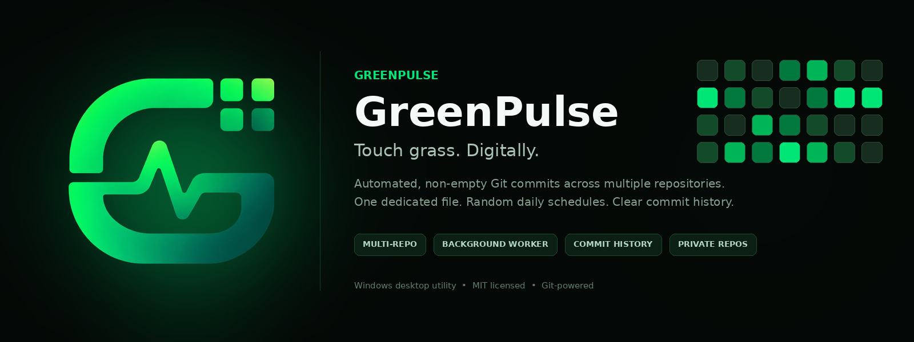
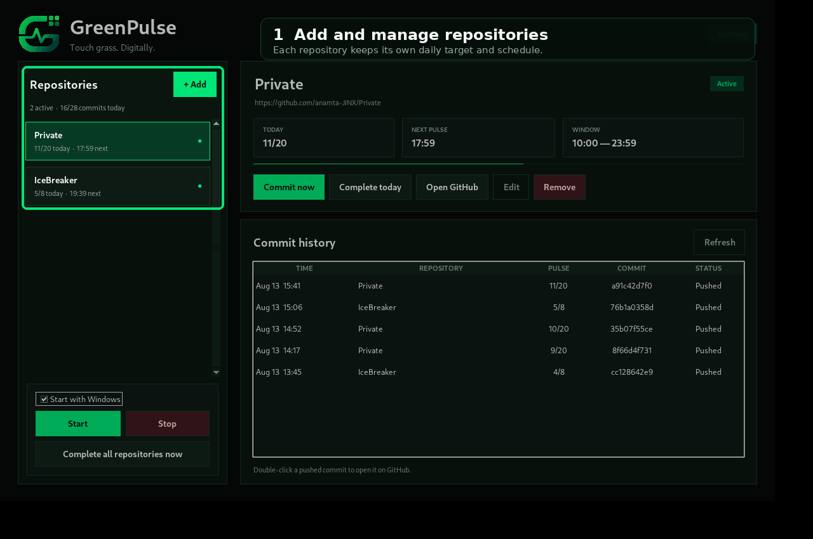
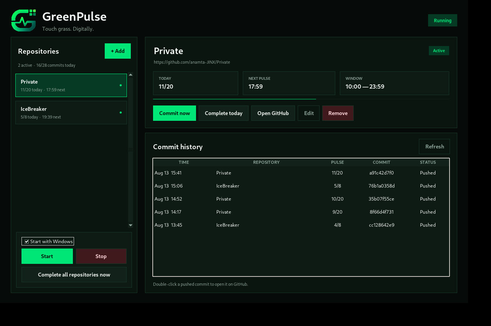
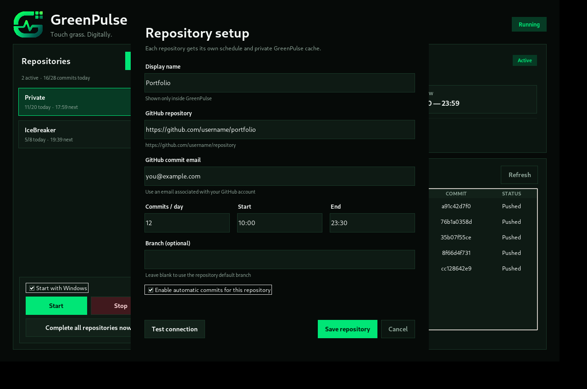
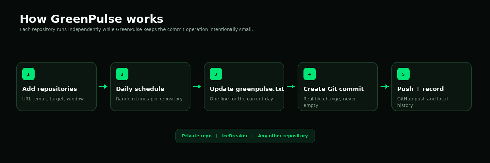

<p align="center">
  
</p>

<h1 align="center">GreenPulse</h1>
<p align="center"><strong>Touch grass. Digitally.</strong></p>
<p align="center">
  A Windows desktop utility for scheduled, non-empty Git commits across multiple GitHub repositories.
</p>

<p align="center">
  
  
  
  
</p>

---

## What GreenPulse does

GreenPulse manages one dedicated file in each repository you configure:

```text
greenpulse.txt
```

Every scheduled pulse changes the current day's line, creates a normal non-empty Git commit, pushes it to the selected repository, and records the result in the local GreenPulse history.

For a target of 20 commits, the same line progresses like this:

```text
2026-08-13 | GreenPulse 01/20
2026-08-13 | GreenPulse 02/20
2026-08-13 | GreenPulse 03/20
...
2026-08-13 | GreenPulse 20/20
```

After the final pulse there is still only one line for that date. The next day adds a new line.

---

## Product preview

<p align="center">
  
</p>

<p align="center">
  
</p>

Repository configuration is independent for each project:

<p align="center">
  
</p>

---

## Workflow

<p align="center">
  
</p>

For each enabled repository GreenPulse:

1. Maintains its own private working clone.
2. Generates a randomized daily schedule inside your chosen time window.
3. Pulls the current repository state before a pulse.
4. Changes only `greenpulse.txt`.
5. Verifies that only `greenpulse.txt` is staged.
6. Creates a normal Git commit.
7. Pushes the commit with your existing Git credentials.
8. Saves the result to the local commit history.

Several repositories can run at the same time. Each repository has its own schedule, progress counter, branch, commit email and lock.

---

## Features

### Multiple repositories

GreenPulse can manage several repositories from one dashboard. Every repository can have its own:

- display name
- GitHub repository URL
- GitHub-associated commit email
- commits-per-day target
- start time
- end time
- branch
- enabled/paused state

### Background worker

Press **Start** once and GreenPulse launches a separate background worker. Closing the dashboard does not stop the worker.

Enable **Start with Windows** if you want the worker to resume automatically after Windows sign-in.

### Commit now

Creates the next GreenPulse commit immediately for the selected repository.

### Complete today

Creates every remaining commit for the selected repository immediately. Each pulse remains an individual Git commit; GreenPulse can send the completed batch in one network push.

### Complete all repositories now

Finishes today's remaining targets across all enabled repositories.

### Commit history

The dashboard stores and displays:

- timestamp
- repository
- pulse number
- commit hash
- branch
- status
- creation mode

Double-click a pushed commit to open it on GitHub.

### Cache repair

Before using a cached clone GreenPulse checks its `origin`. If the cache is incomplete, missing `origin`, or points at the wrong repository, GreenPulse rebuilds only that private cache.

---

## Requirements

### To run the included source launcher

- Windows 10 or Windows 11
- Python 3.10 or newer
- Python Launcher for Windows (`py.exe` / `pyw.exe`)
- Git for Windows
- access to the GitHub repository you configure

The application source itself uses only the Python standard library.

### For private repositories

Your current Windows user must already be able to clone and push the private repository with Git. HTTPS authentication is delegated to Git Credential Manager; GreenPulse does not store your GitHub password or personal access token.

---

# How to run GreenPulse

## Option 1 — Run the included `GreenPulse.exe`

The project includes:

```text
GreenPulse.exe
GreenPulse-script.pyw
```

`GreenPulse.exe` is a lightweight Windows source launcher. Keep it beside `GreenPulse-script.pyw`, `GreenPulse.pyw`, the `greenpulse/` folder and `assets/` folder.

Double-click:

```text
GreenPulse.exe
```

This launcher uses the Python installation already on your Windows machine.

## Option 2 — Run from source with the BAT launcher

Double-click:

```text
GreenPulse.bat
```

or run directly from PowerShell:

```powershell
py -3 GreenPulse.pyw
```

## Option 3 — Build a standalone Windows EXE

Double-click:

```text
build_exe.bat
```

The build script:

1. checks for Python 3.10+
2. creates an isolated `.venv-build` environment
3. installs PyInstaller
4. cleans old `build/` and `dist/` folders
5. packages the complete `greenpulse` package
6. embeds `assets/greenpulse.ico`
7. runs an automatic import self-test
8. opens Explorer with the finished EXE selected

Output:

```text
dist\GreenPulse.exe
```

The standalone build uses the GreenPulse icon from:

```text
assets\greenpulse.ico
```

The self-test was added specifically to prevent broken builds that launch with errors such as:

```text
ModuleNotFoundError: No module named 'greenpulse'
```

The PyInstaller spec explicitly adds the project root to the import path and collects all `greenpulse` submodules.

---

## First setup

Open GreenPulse and click **Add repository**.

Example:

```text
Display name:   Private
Repository:     https://github.com/username/private
Commit email:   you@example.com
Commits / day:  20
Start:          10:00
End:            23:59
Branch:         [blank]
Enabled:        Yes
```

Use **Test connection** first. If it succeeds, save the repository and press **Start**.

For a private repository, Git Credential Manager may ask you to authenticate the first time Git needs access.

---

## Repository safety

GreenPulse does not work inside your normal development folders.

Its private clones live under:

```text
%USERPROFILE%\.greenpulse\repos\
```

Before every GreenPulse commit it verifies the cache and stages only:

```text
greenpulse.txt
```

If another file is unexpectedly modified in the GreenPulse cache, that pulse is stopped.

GreenPulse does not intentionally:

- rewrite source code
- edit your normal local project folders
- create empty commits
- store GitHub passwords
- store personal access tokens

---

## Application data

Runtime data is stored outside the source project:

```text
%USERPROFILE%\.greenpulse\
├── config.json
├── state.json
├── history.jsonl
├── greenpulse.log
├── worker.pid
├── locks\
└── repos\
```

### `config.json`

Stores repository configuration and application settings.

### `state.json`

Stores today's generated schedules and completion state.

### `history.jsonl`

Stores the commit history displayed in the dashboard.

### `greenpulse.log`

Contains diagnostic background-worker and Git information.

### `worker.pid`

Tracks the active background worker so GreenPulse does not launch duplicates.

### `locks/`

Contains per-repository locks so two GreenPulse operations cannot write the same cached repository simultaneously.

### `repos/`

Contains GreenPulse's private working clones. These are not your normal local project folders.

---

# Project structure

```text
GreenPulse/
│
├── GreenPulse.exe
├── GreenPulse-script.pyw
├── GreenPulse.pyw
├── GreenPulse.bat
├── GreenPulse.spec
├── build_exe.bat
├── requirements.txt
├── README.md
├── LICENSE
├── .gitignore
│
├── assets/
│   ├── greenpulse-logo.png
│   ├── greenpulse.ico
│   ├── greenpulse-banner.png
│   ├── greenpulse-demo.gif
│   ├── greenpulse-ui.png
│   ├── greenpulse-repository-setup.png
│   └── greenpulse-workflow.png
│
├── greenpulse/
│   ├── __init__.py
│   ├── models.py
│   ├── storage.py
│   ├── utils.py
│   ├── resources.py
│   ├── git_service.py
│   ├── scheduler.py
│   └── ui.py
│
└── tests/
    └── test_core.py
```

---

## Source-code map

### `GreenPulse.pyw`

Main application entry point. It decides whether to launch the dashboard, background worker, demo mode, version output or packaged-build self-test.

### `GreenPulse.exe` + `GreenPulse-script.pyw`

Lightweight Windows launcher for running the checked-in source without opening a terminal window.

### `greenpulse/models.py`

Defines the repository and application configuration models.

### `greenpulse/storage.py`

Reads and writes config, state, history, logs, PID information and GreenPulse runtime directories.

### `greenpulse/utils.py`

Contains URL normalization, GitHub repository parsing, time parsing, cache naming and other small shared helpers.

### `greenpulse/resources.py`

Resolves asset paths correctly when running from source or from a PyInstaller executable.

### `greenpulse/git_service.py`

Owns Git operations: clone, cache validation, remote repair, fetch, pull, file update, staging checks, commit creation and push.

### `greenpulse/scheduler.py`

Owns randomized schedules, background processing, repository locking, worker lifecycle, Start-with-Windows behavior and manual completion operations.

### `greenpulse/ui.py`

Contains the Tkinter desktop UI, repository setup dialog, repository list, progress view, controls and commit-history table.

### `tests/test_core.py`

Tests schedule generation, time-window validation and the guarantee that GreenPulse commits are non-empty and affect only `greenpulse.txt`.

### `GreenPulse.spec`

PyInstaller build configuration. It includes all GreenPulse Python submodules and embeds the GreenPulse application icon.

### `build_exe.bat`

Reproducible Windows build script for producing and validating `dist\GreenPulse.exe`.

---

## Development

Run the tests from the project root:

```powershell
py -3 -m unittest discover -s tests -v
```

Run the UI from source:

```powershell
py -3 GreenPulse.pyw
```

Display the version:

```powershell
py -3 GreenPulse.pyw --version
```

Run the import self-test:

```powershell
py -3 GreenPulse.pyw --self-test
```

---

## Commit format

GreenPulse uses explicit messages so its automated activity remains recognizable:

```text
chore(greenpulse): pulse 07/20 [2026-08-13]
```

Only `greenpulse.txt` should be part of a GreenPulse commit.

---

## Troubleshooting

### `No module named 'greenpulse'` in a built EXE

Use the `build_exe.bat` included in this version. The spec now includes the project root in `pathex`, explicitly collects the complete `greenpulse` package, and verifies the built EXE with `--self-test` before reporting success.

### Repository access fails

Test Git directly:

```powershell
git ls-remote https://github.com/username/repository HEAD
```

For a private repository, make sure the GitHub account authenticated through Git Credential Manager has repository access.

### `origin` is missing or incorrect

GreenPulse validates the cached `origin` before each operation. If that GreenPulse-owned cache is broken, it is automatically rebuilt.

### Commit is not credited to the expected GitHub account

Make sure the commit email configured for that repository is associated with the intended GitHub account.

### Background worker is stopped

Open the dashboard and press **Start**. Enable **Start with Windows** if you want the worker to launch automatically after sign-in.

---

## Author

**Anamta Gohar**  
`anamta.gohar25@gmail.com`

---

## License

GreenPulse is released under the MIT License.

```text
Copyright (c) 2026 Anamta Gohar <anamta.gohar25@gmail.com>
```

See [`LICENSE`](LICENSE) for the complete license text.
