<p align="center">
  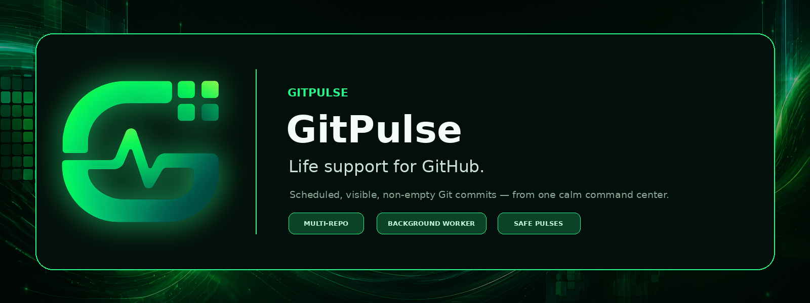
</p>

<p align="center">
  <a href="#quick-start"><strong>Quick start</strong></a> ·
  <a href="#how-it-works"><strong>How it works</strong></a> ·
  <a href="#build-the-real-standalone-exe"><strong>Windows build</strong></a> ·
  <a href="#safety-model"><strong>Safety</strong></a> ·
  <a href="#license-and-ownership"><strong>License</strong></a>
</p>

<p align="center">
  
  
  
  
</p>

<h1 align="center">GitPulse</h1>
<p align="center"><strong>Life support for GitHub.</strong></p>
<p align="center">
  A focused Windows desktop utility for scheduled contribution pulses and opt-in hourly syncing of changes you explicitly stage in local repositories.
</p>

---

## The pulse, in one minute

GitPulse manages one deliberately boring file in each configured repository:

```text
gitpulse.txt
```

Each scheduled pulse updates the current day's line, creates a normal Git commit, pushes it through your existing Git credentials, and records the result in the local activity feed.

```text
2026-08-13 | GitPulse 01/20
2026-08-13 | GitPulse 02/20
...
2026-08-13 | GitPulse 20/20
```

No empty commits. No surprise staging. Scheduled pulses remain isolated; local-project syncing happens only for folders you explicitly connect.

## Product preview

<p align="center">
  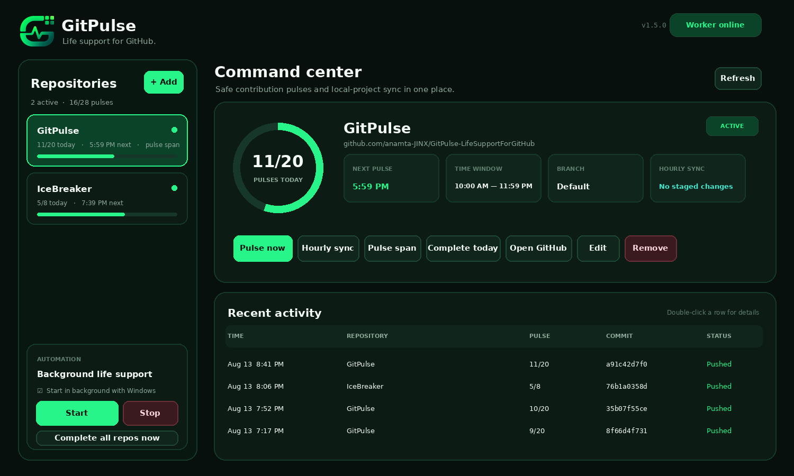
</p>

The refreshed command center puts daily progress, the next pulse, worker health, repository controls and commit history in one clear view.

Every visible time uses the familiar 12-hour **AM/PM** format. Start and end
times use read-only hour, minute and AM/PM selectors, so invalid clock values
cannot be entered.

### Setup tutorial

<p align="center">
  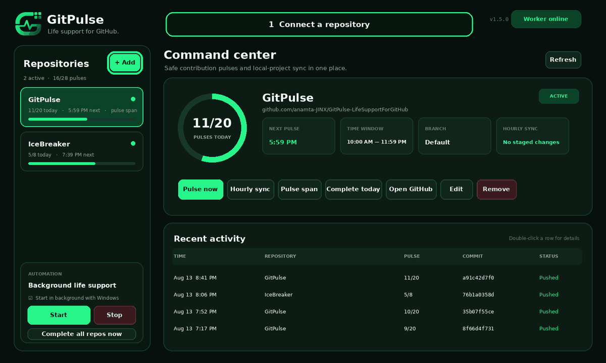
</p>

<details>
<summary><strong>Open the Add/Edit repository previews</strong></summary>
<br>

| Add repository | Edit repository |
| --- | --- |
| 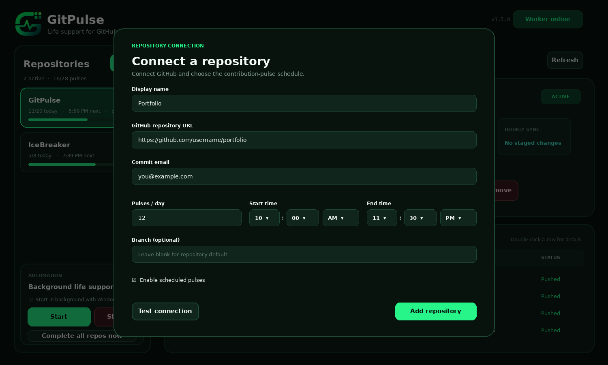 | 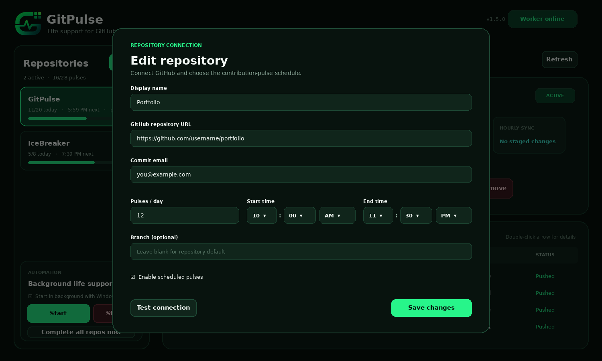 |

The action bar is pinned below the scrolling form, so **Add repository** and
**Save changes** remain visible at high Windows display scaling.
</details>

### Hourly Sync setup

<p align="center">
  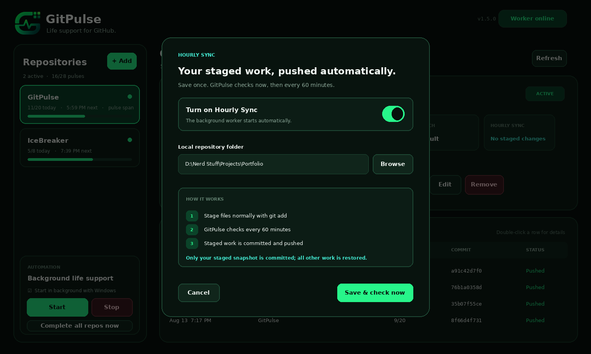
</p>

Hourly Sync has its own focused setup screen: turn it on, choose the matching local repository, then select **Save & check now**. GitPulse validates the folder, starts automation, and immediately reports whether anything is staged.

### Automatic pulse span

<p align="center">
  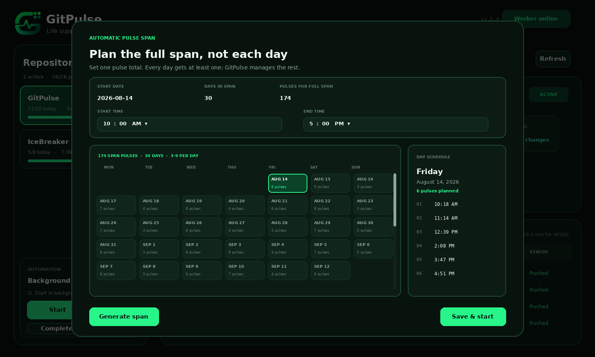
</p>

Choose a starting date, one to thirty days, one pulse total for the entire span,
and a validated AM/PM time window. GitPulse divides that exact total randomly
across the selected dates, guarantees at least one pulse per day, and generates
unique times inside the window. Select any date to inspect its schedule before
choosing **Save & start**.

## Highlights

| Capability | What it gives you |
| --- | --- |
| Multi-repository dashboard | Independent targets, windows, branches and status for every repository. |
| Real non-empty commits | Every pulse changes `gitpulse.txt`; GitPulse never relies on `--allow-empty`. |
| Natural commit subjects | Scheduled pulses use **Update** and Hourly Sync uses **Update files**—no product branding in commit titles. |
| Automatic pulse span | Set one total for 1–30 days; GitPulse distributes it across the complete span with at least one pulse on every selected day. |
| Validated AM/PM controls | Dashboard, forms, planner, status and activity use 12-hour time; hour, minute and AM/PM dropdowns reject invalid values. |
| Managed-file initialization | Connection reports whether `gitpulse.txt` exists; the first pulse creates it when missing and later pulses preserve it. |
| Immediate manual pulse | **Pulse now** starts immediately, locks against duplicate clicks and displays an animated working state until completion. |
| Background controls | Start, Stop, Windows background startup and Complete-all actions stay together in the bottom-left panel. |
| Randomized daily timetable | Stable for the day, regenerated for a new day or changed settings. |
| Private repository support | Authentication stays with Git and Git Credential Manager. |
| Isolated scheduled pulses | Contribution pulses remain inside GitPulse's private caches and touch only `gitpulse.txt`. |
| Hourly local sync | Checks an opted-in local repository every hour and commits only its existing Git index—the files you staged with `git add`. |
| Staging-safe behavior | Unstaged edits and untracked files remain untouched, including partially staged files. |
| Sliding repository names | Long names pause for three seconds, then glide horizontally instead of being cut off. |
| Commit history | Timestamp, repository, pulse number, hash and push status in one feed. |
| Recovery-aware Git flow | Validates `origin`, repairs bad caches, retries pending pushes and safely aligns behind or diverged local branches. |
| Self-updating worker | Detects and replaces an older still-running worker when the application is upgraded. |
| Native Windows tray | The background worker stays visible in the notification area, opens on double-click and reports a completed span even when the dashboard is closed. |
| Visible startup diagnostics | Windowed failures show an error and write `startup-error.log` instead of silently disappearing. |
| Tested Windows packaging | Local builder and GitHub Actions both run tests and verify the packaged executable. |

## Quick start

### Requirements

- Windows 10 or Windows 11
- Git for Windows
- permission to push to each repository
- Python 3.10+ only when using the source launcher

GitPulse does **not** store a GitHub password or personal access token. HTTPS authentication is delegated to Git Credential Manager.

### Run the included source app

Keep the extracted folder together and double-click:

```text
GitPulse.exe
```

The included root executable is a complete appended-archive Windows GUI launcher. It opens `GitPulse.pyw` from its own directory—the same source path used by the working `run_gitpulse.bat` fallback—without opening a console window. Python-side startup failures open a native error dialog and are recorded at:

```text
%USERPROFILE%\.gitpulse\startup-error.log
```

The no-console compatibility launcher checks both `pyw.exe` and `pythonw.exe`:

```text
run_gitpulse.vbs
```

For visible diagnostics, use the batch fallback:

```text
run_gitpulse.bat
```

For a completely standalone application that does not require Python or nearby source files, build or download the real packaged executable described below.

### Connect your first repository

1. Select **+ Add**.
2. Enter the repository URL and an email associated with your GitHub account.
3. Choose the normal pulses per day and select the allowed time window using the hour, minute and AM/PM dropdowns.
4. Leave **Branch** blank to use the repository default branch.
5. Select **Test connection**. GitPulse reports whether `gitpulse.txt` already
   exists or will be created by the first pulse.
6. Select **Add repository**. When editing later, the same pinned action bar
   shows **Save changes**.
7. Select **Start** in the bottom-left automation panel.

Select **Pulse now** whenever you want a pulse immediately. The button becomes locked and animated while GitPulse fetches, creates the commit and pushes it, then unlocks only after the operation finishes.

### Build an automatic pulse span

1. Select a repository and choose **Pulse span**.
2. Enter a start date and choose **1–30 days**.
3. Set **Pulses for full span**—for example, 25 pulses across four days.
4. Choose the start and end time from the validated hour, minute and AM/PM dropdowns.
5. Select **Generate span**. GitPulse might divide 25 pulses as 6, 9, 3 and 7 while generating different times for every date.
6. Inspect any date, then select **Save & start**.

The saved span keeps the exact total you requested, assigns at least one pulse
to every selected date and varies daily counts whenever the total allows. While
a span is saved, it is the complete automatic schedule: GitPulse does not add
normal per-day pulses before or after its selected dates. When every planned
pulse is complete, GitPulse records the completed span and sends a Windows
notification.

Saving a span also enables background operation and Windows startup. After you
sign in, GitPulse starts silently in the notification area—even if the dashboard
never opens. Double-click the tray icon to open GitPulse, or right-click it to
open the app or exit the background worker.

### Enable Hourly Sync

1. Select the repository, then choose **Hourly sync**.
2. Turn on **Hourly Sync** and choose the matching local repository folder.
3. Select **Save & check now**. GitPulse validates the folder, starts the worker, and checks immediately.
4. Stage exactly what you want included from your normal terminal or editor:

   ```powershell
   git add path\to\file
   ```

5. GitPulse checks automatically every 60 minutes. Reopen **Hourly sync** and select **Save & check now** whenever you want another immediate check.

GitPulse verifies that the folder's `origin` matches the connected GitHub URL. It refuses detached HEAD state and a configured-branch mismatch. When the local branch is behind, GitPulse protects the full staged, unstaged and untracked worktree, then safely fast-forwards or rebases local commits before restoring the exact staged selection. A real content conflict is aborted without committing and its exact Git error appears directly in the dashboard. Failed checks retry automatically after five minutes.

Upgrades are worker-safe: if an older background process is still online, the new application recognizes its build signature, replaces it automatically and runs the current Hourly Sync code.

The first private-repository operation may open Git Credential Manager so you can authenticate.

### Create a Desktop shortcut

Double-click:

```text
Create GitPulse Shortcut.bat
```

The shortcut creator prefers `dist\GitPulse.exe` when a standalone build exists. Otherwise it launches `run_gitpulse.vbs`, which silently checks both Python launch paths before opening `GitPulse.pyw`. The shortcut always uses the correct working directory and GitPulse icon.

## Build the real standalone EXE

Double-click:

```text
build_exe.bat
```

The builder creates an isolated environment, installs PyInstaller, packages every GitPulse module and asset, then launches a packaged import self-test. A broken build is not reported as successful.

```text
dist\GitPulse.exe
```

That file is the portable Windows application: it does not need Python, `GitPulse.pyw`, or the `gitpulse/` source directory beside it.

### Build automatically on GitHub

The repository includes `.github/workflows/windows-build.yml`. Every push or pull request to `main` runs the tests on Windows and uploads a `GitPulse-Windows-x64` artifact containing the standalone executable. Version tags such as `v1.5.0` trigger the same verified build.

## How it works

<p align="center">
  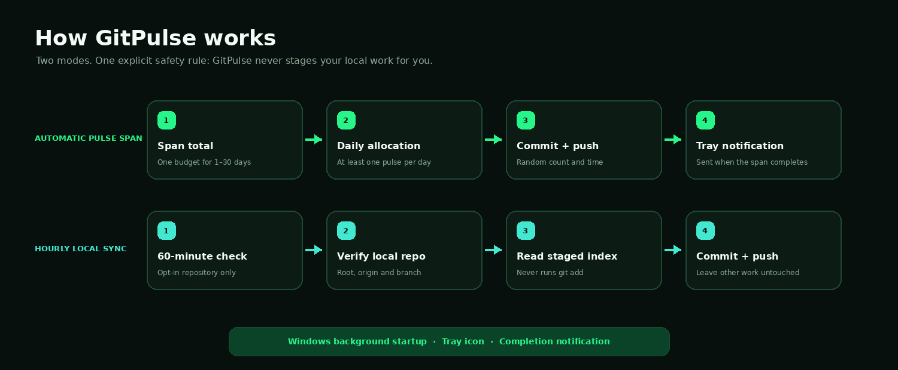
</p>

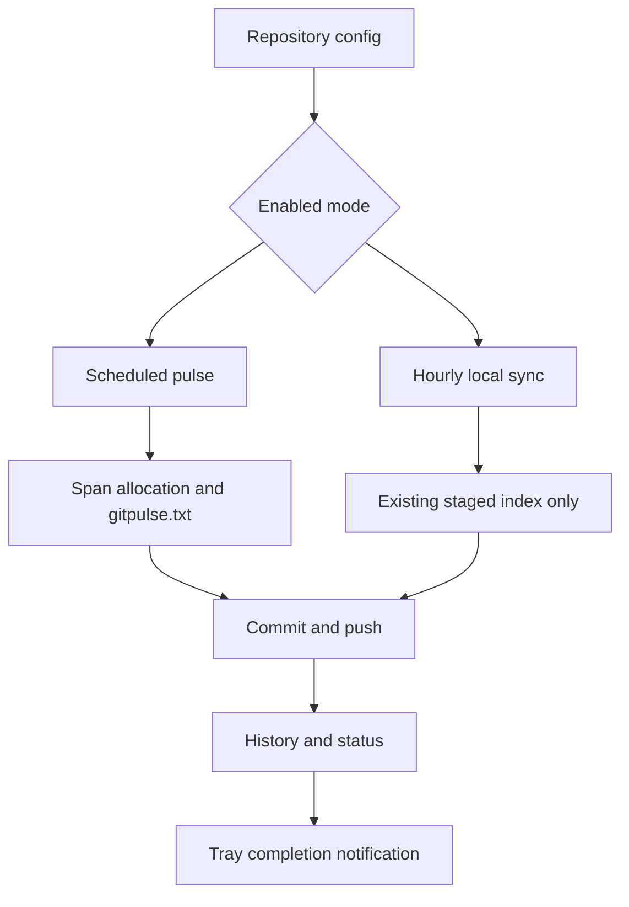

Each enabled repository runs independently. GitPulse deliberately processes at most one overdue scheduled slot per repository on each worker tick, preventing a restart from unleashing an uncontrolled burst.

Hourly local sync uses a separate 60-minute clock and can stay enabled even when scheduled pulses are paused.

### Runtime sequence

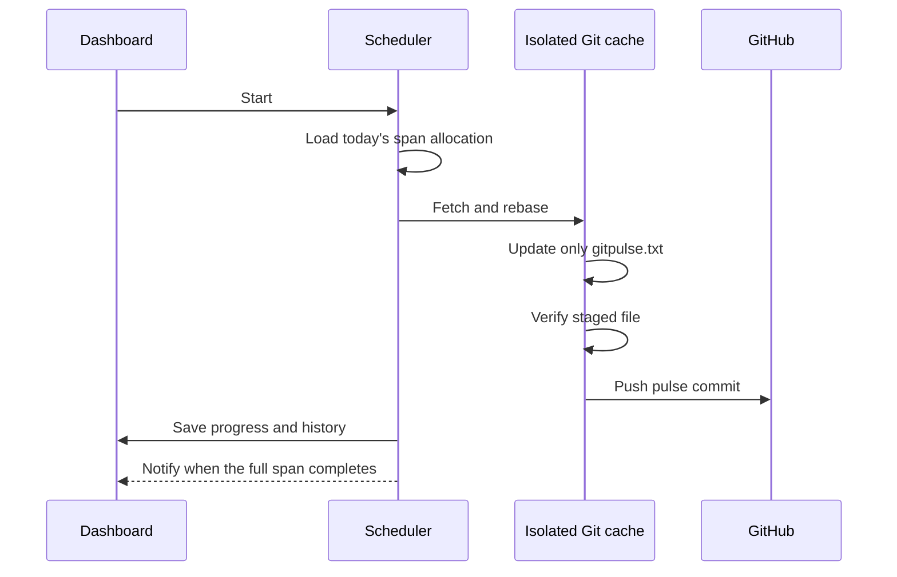

### Hourly local-sync sequence

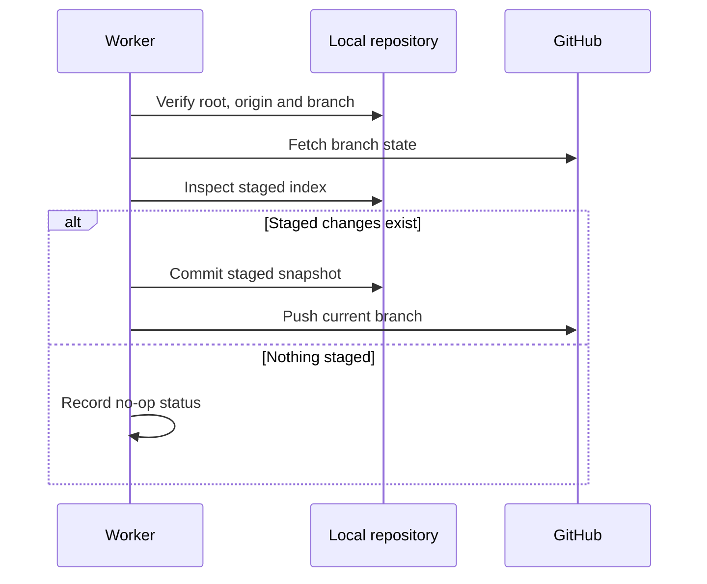

## Architecture

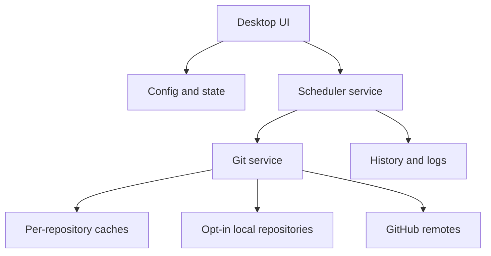

| Layer | Responsibility |
| --- | --- |
| `GitPulse.pyw` | Dashboard, worker, version and packaged self-test entry point. |
| `gitpulse/ui.py` | Modern command center, repository dialog, actions and activity feed. |
| `gitpulse/scheduler.py` | Span scheduling, completion state, worker lifecycle, repository locks and silent Windows startup. |
| `gitpulse/tray.py` | Native Windows notification-area icon, menu and span-completion balloon. |
| `gitpulse/git_service.py` | Cache pulses, local-origin verification, staged-index commits and safe pushes. |
| `gitpulse/storage.py` | Configuration, state, history, diagnostics and runtime directories. |
| `gitpulse/models.py` | Serializable application and repository configuration. |
| `gitpulse/utils.py` | URL, time, branch and repository helpers. |

## Data model

GitPulse uses small local JSON/JSONL files rather than a database. The ERD below documents their logical relationships.

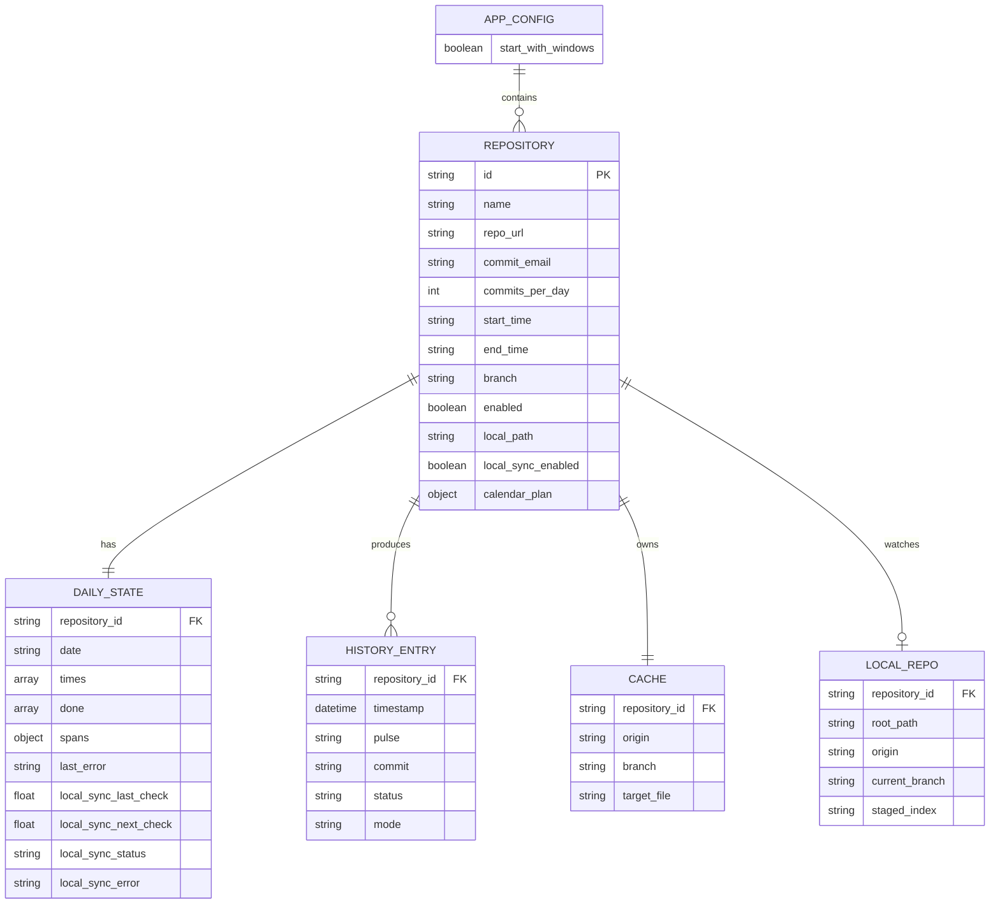

## Project structure

```text
GitPulse-Complete/
├── .github/
│   └── workflows/
│       └── windows-build.yml       # Tested Windows artifact build
├── assets/
│   ├── gitpulse-logo.png         # Product mark
│   ├── gitpulse.ico              # Windows application icon
│   ├── gitpulse-banner.png       # README hero
│   ├── gitpulse-ui.png           # Dashboard preview
│   ├── gitpulse-repository-setup.png
│   ├── gitpulse-repository-edit.png
│   ├── gitpulse-hourly-sync.png
│   ├── gitpulse-calendar.png
│   ├── gitpulse-tutorial.gif     # Animated setup tutorial
│   ├── gitpulse-demo.gif
│   ├── gitpulse-workflow.png
│   └── gitpulse-banner-background.png
├── gitpulse/
│   ├── __init__.py
│   ├── git_service.py
│   ├── models.py
│   ├── resources.py
│   ├── scheduler.py
│   ├── storage.py
│   ├── tray.py
│   ├── ui.py
│   └── utils.py
├── tests/
│   └── test_core.py
├── THIRD_PARTY_LICENSES/
│   └── distlib-LICENSE.txt         # License for the source launcher binary
├── tools/
│   ├── build_gui_launcher.py       # Builds and verifies the root GUI launcher
│   ├── generate_readme_assets.py
│   └── w64-launcher.exe            # Branded, licensed distlib launcher stub
├── GitPulse.exe                 # Lightweight source launcher
├── GitPulse.pyw                 # Main entry point
├── run_gitpulse.vbs             # Silent compatibility launcher
├── run_gitpulse.bat             # Source fallback
├── GitPulse.spec                # Standalone package specification
├── build_exe.bat                  # Reproducible Windows builder
├── Create GitPulse Shortcut.bat
├── LICENSE
├── NOTICE.md
├── README.md
├── START_HERE.txt
├── requirements.txt
└── requirements-dev.txt
```

## Runtime files

GitPulse stores mutable data outside the project folder:

```text
%USERPROFILE%\.gitpulse\
├── config.json
├── state.json
├── history.jsonl
├── gitpulse.log
├── startup-error.log
├── worker.pid
├── worker.json
├── locks\
└── repos\
```

This separation makes the distributed application folder replaceable without wiping your repositories, schedules or history.

When **Start in background with Windows** is enabled, GitPulse also creates a
small silent launcher in the current user's Windows Startup folder. It contains
no credentials; it only starts this installation's background worker. The worker
keeps the tray icon available and persists span progress in `state.json`, so a
restart does not reset completed dates or resend an already delivered completion
notification.

## Safety model

### Scheduled pulses

Before every pulse GitPulse:

1. validates that the configured URL is a GitHub repository;
2. works only inside `%USERPROFILE%\.gitpulse\repos\`;
3. checks that the cached `origin` still matches the configured URL;
4. fetches and rebases onto the selected remote branch;
5. stages only `gitpulse.txt`;
6. checks that the staged diff is non-empty;
7. aborts if any unexpected cached file is modified;
8. pushes with the current Windows user's Git credentials.

If a network push fails, the commit remains in the isolated cache. The next sync detects commits ahead of the remote and retries them before creating another pulse.

### Hourly local sync

For an opted-in local repository GitPulse:

1. verifies the selected folder is the repository root;
2. verifies `origin` matches the connected GitHub URL;
3. refuses detached HEAD and a branch mismatch;
4. fetches and compares the local and remote branches;
5. protects staged, unstaged and untracked work in a temporary safety stash;
6. fast-forwards a behind-only branch or safely rebases local commits on a diverged branch;
7. aborts a real merge conflict and restores the safety backup instead of committing;
8. reads the restored staged index without running `git add`;
9. commits exactly that staged snapshot as **Update files** and leaves unstaged/untracked work uncommitted;
10. performs a normal branch push after the commit succeeds.

As with a normal `git push`, any commits already ahead on the same local branch are pushed together with the new staged-work commit. If a push fails after GitPulse commits, its exact commit is tracked internally and retried without relying on the visible commit subject. Failed checks retry after five minutes. When nothing is staged, GitPulse does not push unrelated local-only commits during a normal no-op check.

## Contribution-graph checklist

GitPulse creates real commits, but GitHub decides whether a commit appears on a profile. Check all of these:

- the configured commit email is associated with the intended GitHub account;
- the commit lands on the repository's default branch or `gh-pages` branch;
- the repository is standalone rather than a fork;
- the GitHub account meets the repository participation criteria;
- **Contribution settings → Private contributions** is enabled if you want private activity counts to be visible.

See GitHub's official [profile contribution criteria](https://docs.github.com/en/account-and-profile/reference/profile-contributions-reference), [missing-contribution troubleshooting](https://docs.github.com/en/account-and-profile/how-tos/contribution-settings/troubleshooting-missing-contributions), and [private contribution visibility](https://docs.github.com/en/account-and-profile/how-tos/contribution-settings/manage-visibility-settings-for-private-contributions-and-achievements).

## Development

Run the core suite:

```powershell
py -3 -m unittest discover -s tests -v
```

Run the UI from source:

```powershell
py -3 GitPulse.pyw
```

Run the demo dashboard:

```powershell
py -3 GitPulse.pyw --demo
```

Verify every packaged import without opening the UI:

```powershell
py -3 GitPulse.pyw --self-test
```

Rebuild and verify the lightweight root GUI launcher:

```powershell
py -3 tools\build_gui_launcher.py
```

Regenerate the README visual assets:

```powershell
py -3 -m pip install -r requirements-dev.txt
py -3 tools\generate_readme_assets.py
```

## Troubleshooting

### Double-clicking the app appears to do nothing

1. Keep the complete extracted folder together.
2. Run `run_gitpulse.bat` once to confirm that Python and Tkinter are available.
3. Open `%USERPROFILE%\.gitpulse\startup-error.log` for the exact startup traceback.
4. Run `build_exe.bat` and use `dist\GitPulse.exe` for the dependency-free build.
5. Re-run `Create GitPulse Shortcut.bat` after moving the folder so the shortcut targets the current location.

### `No module named gitpulse`

Use the included `GitPulse.spec` and `build_exe.bat`. The spec adds the project root, collects all `gitpulse` submodules and verifies imports before the build is accepted.

### Repository access fails

Check Git directly:

```powershell
git ls-remote https://github.com/username/repository HEAD
```

If that command cannot access the repository, authenticate through Git Credential Manager and retry **Test connection**.

### Hourly Sync says it needs attention

The exact Git error now appears beneath the repository metrics. Open **Hourly sync** and select **Save & check now** to retry immediately. GitPulse automatically replaces an outdated worker, retries normal failures after five minutes, and safely handles behind or diverged branches. Only a genuine Git content conflict requires manual resolution.

### A commit is not credited to the expected account

Inspect the commit's author email, then verify that exact email under the intended GitHub account. GitHub may take time to rebuild contribution attribution after an email is added.

## License and ownership

GitPulse source code is released under the [MIT License](LICENSE):

```text
Copyright (c) 2026 Anamta Gohar <anamta.gohar25@gmail.com>
```

The license notice must remain in copies and substantial portions of the software. The GitPulse name, logo, icon and branded visual identity remain the original creative work of **Anamta Gohar**; see [NOTICE.md](NOTICE.md) for the attribution and brand-use notice.

## Author

Built and maintained by **Anamta Gohar**  
Email: `anamta.gohar25@gmail.com`  
GitHub: [@anamta-JINX](https://github.com/anamta-JINX)

<p align="center"><strong>GitPulse — Life support for GitHub.</strong></p>
